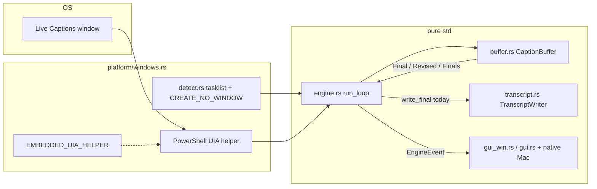
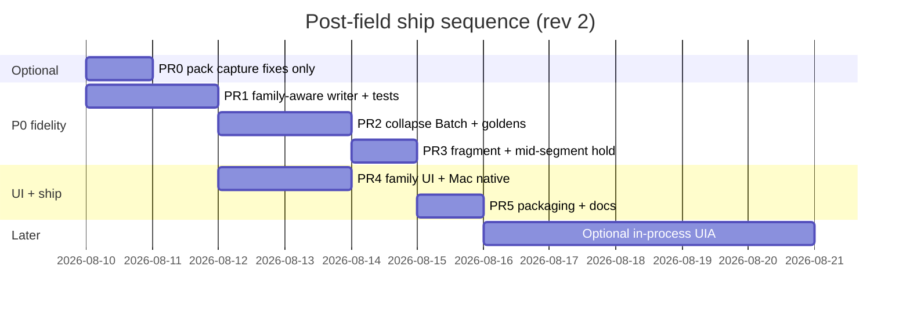
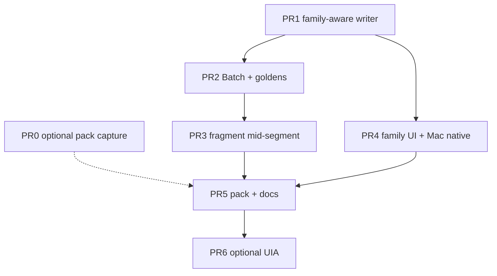

# Interpres Post–Field-Test Improvement Plan (Windows-first, Mac parity)

| Field | Value |
|-------|--------|
| **Document** | Whole-product improvement plan after 2026-08-09 Windows field session |
| **Author** | (maintainer / agent) |
| **Date** | 2026-08-09 |
| **Status** | Draft (rev 4 — hard-negative CI set verified vs shipped matcher) |
| **Product** | Interpres v0.2 — zero-crates.io local companion to OS Live Captions |
| **Evidence** | `D:\downloads\Interpres\2026-08-09_07-18-51.txt` (+ `.debug.log`) |
| **Supersedes / extends** | `MD/FIX-KNOWN-ISSUES-PLAN.md` (Mac phases A–E); complements `MD/LIVE-CAPTIONS-REBUILD-PLAN.md` |

---

## Overview

Interpres records what **Windows / macOS Live Captions** already show into dated session `.txt` files. It is **not** a speech engine. A long Windows field session (hiring-video audio, ~30 min content with mid-session AFK and 2× playback in the second half) proved that recent reliability work is solid: **no UIA scrape failures**, **no helper-missing errors**, **no console flash** in that run, and captions kept up under denser 2× speech.

What remains is **transcript fidelity and long-session hygiene**, not capture plumbing:

1. **Same-family near-duplicates** still land as separate lines in `.txt` and Session history (highest ROI).
2. **Fragment / weak-end lines** (~30–70 incomplete or mid-thought finals depending on definition).
3. **Debug log bloat** on long AFK (`max_stale` 3101+, ~783 KB / 5.5k lines with Debug ON).
4. **Packaged release lag**: CREATE_NO_WINDOW, helper parent-walk, and embed fallback are **in tree** but need a shipped Windows portable zip + docs.

This plan is a **whole-product track map (A–E)** with concrete file/function targets, field-derived unit tests, ordered PRs, and Mac parity rules under the hard **zero crates.io** constraint.

**Rev 2 focus (review):** coherent writer invariants (`last_final_text` + family ring), **family-aware** Session UI replace (not last-line-only), full Revised→collapse inventory, adjacent dual root-cause beyond RC1, Mac native FFI files, and PR ordering so disk correctness does not depend solely on `BufferEmit::Revised`.

**Rev 3 focus (re-review residuals):** `RewriteResult = Rewrote | NoOp | NoMatch` so same-family + `!prefer_polish` never appends; PR1 requires `prefer_polish` export + `flush_buffer` → `write_revised`; PR2 lists `engine.rs`/`main.rs` for `Batch`; `history_apply_*` last_hist = last row body only; hard-negative set CI-safe; `line_count` on rewrite; A1b Batch-only (no soft defer language).

**Rev 4:** Hard-negative CI pairs re-checked against shipped `same_or_refinement` (`shared_prefix >= 4`, containment, Jaccard). Boilerplate frame pair removed from hard set (true today); optional stem-divergence noted as matcher-change-required, not a current CI oracle.

---

## Background & Motivation

### What the field session showed (must ground the plan)

| Metric | Value |
|--------|--------|
| Session file | `2026-08-09_07-18-51.txt` |
| Caption lines | **368** (~6k words class) |
| Wall first→last | **~93 min** (`07:18:58` → `08:52:04`) |
| Mid-session AFK | ~70 min pause; LC surface stayed sticky; session survived |
| Active speech wall | ~20.7 min (per assessment) |
| Content | ~30 min video; second half at **2×** — denser late segment; capture kept up |
| Debug log | **783 018 bytes**, **~5533 lines**, **`max_stale=3101`** |
| Debug emit mix | ~243 `FINAL`, ~376 `REVISED`, ~848 `PARTIAL`, ~4064 `surface_chars=` lines |
| Technical health | No UIA scrape failed; helper found/used; no console flash this run |

### Quality gaps (priority order)

| # | Gap | Severity | Field signal |
|---|-----|----------|--------------|
| 1 | Same-family dual lines (draft + polish) in UI + `.txt` | **P0** | See field stats methodology below |
| 2 | Fragment / weak-end finals | **P1** | ~70 weak-end candidates (no terminal punct + short / open ending) |
| 3 | ASR word errors | **P3 / doc only** | OS Live Captions fidelity — record faithfully; do not “fix ASR” |
| 4 | Debug log volume on idle/AFK | **P1** | Every poll logs full surface even when `skip=true` |
| 5 | Terminal flash on Start (tasklist/powershell) | **P0 ship** | Fixed in tree (`CREATE_NO_WINDOW`); needs packaged release |
| 6 | Helper not found next to `target/release` | **P0 ship** | Fixed: parent walk + embed; needs release pack + START HERE text |
| 7 | Family rewrite + emit collapse | **P0** | Last-line-only disk rewrite; UI last-line replace; Revised→Final paths |

#### Field stats methodology (label carefully)

Counts depend on the detector; use these labels in tests and DoD:

| Label | Method | Approx. count (this session) |
|-------|--------|------------------------------|
| **Loose near-dup adjacent** | Prefix / word-prefix / soft Jaccard ≥0.55 on consecutive caption rows | ~33 pairs |
| **Same-family (strict-ish)** within 5 lines / 20s | Normalized prefix / shared ≥4 leading words / long containment | ~106 pairs; **~85 gap>1**, ~21 gap=1 |
| **Adjacent + current `same_or_refinement` true** | Re-sim of shipped matcher on adjacent likely-family pairs | **~19 already match**, ~2 do not |

So: intervening-line rewrite (gap>1) is the dominant **structural** gap; adjacent duals that **already match** today’s matcher prove a **second** problem (field build / untested rewrite path / emit collapse / swallowed IO) — see RC0.

### Current architecture (relevant path)



**Emission contract today**

| `BufferEmit` | UI (Windows `gui_win.rs`) | UI (Mac `gui.rs` + native) | Disk (`TranscriptWriter::write_final`) |
|--------------|---------------------------|----------------------------|----------------------------------------|
| `Final` | Append unless `same_or_refinement(last_hist, s)` → **replace last only** | Skip append on same family; **does not update** history text | Append, or rewrite **last** line if same family as `last_final_text` |
| `Revised` | `replace_last_history_line` (last row only) | Live + `last_hist` only — **no history API** | Same as Final (`write_final`) |
| `Finals` | Each as Final | Each as Final | Each as append/`write_final` |

**Mac native gap:** `native/macos/interpres_gui.h` / `.m` expose only `interpres_gui_append_history` and `interpres_gui_clear_history` — no replace API.

### Root-cause analysis: why dual lines still hit disk

Four failure modes stacked in the field file / current tree:

#### RC0 — Adjacent duals that already match `same_or_refinement` (must reconcile)

Re-simulating the **shipped** matcher: ~19 adjacent non-equal same-family pairs already return **true** (e.g. `attention to` → `…attention to details`, prefix growth pairs). Under a correct tree where:

1. draft was written as Final → `last_final_text = draft`, and  
2. polish arrives as Final or Revised, and  
3. `write_final` rewrite succeeds,

those duals **should not appear** on disk.

Therefore field duals for matcher-true adjacent pairs imply at least one of:

| Hypothesis | Notes |
|------------|--------|
| **H1 Field build lag** | Session may predate or not fully exercise current `rewrite_last_final` / buffer Revised path |
| **H2 Emit not Revised + last_final desync** | Polish arrives as second **Final** while `last_final_text` is no longer the draft (intervening write, or failed write) |
| **H3 Collapse / short-hold** | Revised mapped to Final event; still should rewrite if last matches — fails when last is not draft |
| **H4 Swallowed IO** | `let _ = w.write_final(...)` drops rewrite errors silently |
| **H5 Untested rewrite** | Adjacent rewrite path exists in code but has **no unit test** — regressions easy |

**Design implication:** PR1 must **unit-test adjacent rewrite** (regression) **and** family-aware rewrite (intervening). Do not claim “matcher goldens alone fix adjacent duals.” Re-test on **current** tree may already collapse some adjacent pairs before matcher work.

#### RC1 — `last_final_text` / rewrite is only the immediately previous line (critical for gap>1)

`TranscriptWriter::write_final` (`src/transcript.rs` ~90–117) rewrites only when:

```text
same_or_refinement(last_final_text, text) && text != last
→ rewrite_last_final  // always rewrites physical LAST caption line
```

Field pattern (very common with Windows multi-segment UIA blobs):

```text
[07:19:30] We have a very different way of doing, things     ← family F draft
[07:19:31] It has very unique and very specific expectations. ← intervening G
[07:19:42] We have a very different way of doing things here… ← F polish → APPENDS
```

Among same-family pairs within 5 lines / 20s: **~85 had gap > 1**. Last-line rewrite cannot fix these even when the matcher succeeds and the buffer emits `Revised`.

#### RC2 — Buffer still emits two **New** finals when family match is weak

`same_or_refinement` (`src/buffer.rs` ~1103–1178) uses exact/normalize, prefix growth, shared leading tokens (≥3–4), Jaccard ≥ **0.72**, and mid-token overlap. Some field pairs need **suffix/tail** heuristics; a few fall in soft Jaccard ~0.55–0.70. Prefer **suffix/token-run** before lowering global Jaccard (false-merge risk).

#### RC3 — Premature leave-window / soft-stable / mid-segment finals of incomplete text

Sources of fragment finals:

| Path | Location | Behavior |
|------|----------|----------|
| Soft-stable force | `observe` when incomplete + substantial | Can Final mid-thought |
| Leave-window `try_commit(..., true)` | short non-stubs OK | Open tails still slip through |
| **Settled mid-segments** | `diff_emit` ~208–213: all-but-last when `word_count >= 8` even if incomplete | Major Windows multi-line blob fragment source |
| Open tails | `… attention to`, `… figure out` | Then longer polish → dual unless family rewrite holds |

#### RC4 — Revised intent lost before disk/UI (collapse inventory)

| Path | File | Bug |
|------|------|-----|
| Leave-window clear (`curr` empty) | `buffer.rs` ~178–180 | `CommitOutcome::Revised` → `finals.push` → emit as Final/Finals |
| `finish()` | `buffer.rs` ~277 | Revised collapsed into Finals; **never** emits `BufferEmit::Revised` |
| **Mix path** | `buffer.rs` ~243–260 | If `revised = Some(r)` **and** `finals` non-empty → return only Finals; **Revised dropped** |
| Engine short-hold empty surface | `engine.rs` ~395–400 | `Final(t) \| Revised(t)` both send **`EngineEvent::Final`** + `write_final` |
| Engine main Revised arm | `engine.rs` ~352–365 | Sends `EngineEvent::Revised` but still `write_final` (last-line only) |

#### What is *not* broken (do not thrash)

- PowerShell UIA path + helper resolution worked entire session  
- `CREATE_NO_WINDOW` + `-WindowStyle Hidden` in tree for helper/tasklist  
- Lifecycle AFK: LC stayed “present”; session did not spuriously `Close` for 70 min idle  
- 2× density: no evidence of cascade UIA failures; dual-finals are fidelity, not lag  
- `rewrite_last_final` mechanics (truncate + rewrite file) work when invoked on the correct line  

### Already landed (this conversation tree — not yet full release)

| Area | Change |
|------|--------|
| `src/platform/windows.rs` | `CREATE_NO_WINDOW`; parent-dir helper search; `include_str!` embed + materialize |
| `src/platform/detect.rs` | `CREATE_NO_WINDOW` on `tasklist` |
| `src/plugin_host.rs` | `CREATE_NO_WINDOW` for helpers |

### Related docs

- `docs/KNOWN-ISSUES.md` — Mac-centric known issues; item 4 (near-dup) marked closed in code 2026-08-05 but **reopened by Windows field evidence**  
- `MD/FIX-KNOWN-ISSUES-PLAN.md` — Phase D dedup polish; needs Windows field golden pairs  
- `MD/LIVE-CAPTIONS-REBUILD-PLAN.md` — architecture north star, zero-dep definition  

---

## Goals & Non-Goals

### Goals

1. **One line per sentence family** in Session history **and** session `.txt` for draft→polish patterns in the field file — including **non-last** family polish (family-aware UI + disk).  
2. **Family-aware disk path** for both `write_final` and `write_revised`, with a coherent `last_final_text` invariant (see A1).  
3. **`same_or_refinement` + goldens** from `2026-08-09_07-18-51.txt`, without reckless Jaccard lowering.  
4. **Fragment policy**: hold incomplete / open-tail / incomplete mid-segments without dropping short real speech.  
5. **Long-session debug hygiene**: rate-limit unchanged surface logs.  
6. **Ship Windows portable** with current capture fixes, helper dual-location, SHA256, SOURCE_COMMIT, START HERE honesty (embed fallback). Optional **PR0** pack-only ship may precede fidelity if users need flash/helper fixes immediately.  
7. **Mac parity**: pure-std buffer/engine/transcript + **family-aware history** via `gui.rs` **and** `native/macos/interpres_gui.{h,m}`.  
8. **Verification**: unit tests + 5–10 min manual matrix from field findings.  

### Non-Goals

| Non-goal | Why |
|----------|-----|
| Become a STT / cloud ASR engine | Product identity: OS LC companion |
| crates.io dependencies | Hard constraint (`Cargo.toml` `[dependencies]` empty) |
| “Fix” Live Captions word accuracy | Record OS text faithfully; document ASR noise |
| Full legal/medical certification | Out of scope |
| Full in-process UIA rewrite in the first ship | Optional Track B later; scaffold exists |
| Auto-launch watcher / tray rewrite | Rebuild plan item; not this field-test plan |
| Change default Save/privacy model | Stay opt-in remember |
| Mac field re-test before Windows ship | Non-blocking (Q6); pure-std tests + native unit/string tests gate Mac code |

---

## Proposed Design

### Track A — Transcript fidelity (priority 1)

#### A0 — Semantics: one family, one durable line

Define a **sentence family** as a set of caption strings that `same_or_refinement` considers the same spoken utterance (draft/growth/polish). Product rule:

| Surface | Rule |
|---------|------|
| Session list (UI) | At most one visible line per family; polish **replaces the matching history row** (scan last K lines — not only the last row) |
| `.txt` | At most one caption row per family; polish **rewrites** that row (clock updates to polish time — **KD14**) |
| `.jsonl` (if enabled) | Append `kind":"revised"` for audit; TXT remains human-canonical single line — **KD13** |
| Live box | Always latest edge; not a second “saved” line |

ASR mishearings that are **different sentences** must remain separate (false-merge risk).

#### A1 — Family-aware disk rewrite + writer invariants

**Problem:** Engine and CLI call `write_final` for Revised. Writer rewrites only when polish matches **`last_final_text`**, and `rewrite_last_final` always rewrites the **physical last** caption line. After F-draft → G → F-polish, if we rewrite F in place but set `last_final_text = F-polish` while last disk line is still G, a later Final that matches F-polish would **overwrite G**. Conversely, G-polish as Final would not match F-polish `last_final_text` and would **append a second G**.

##### Invariant (mandatory — KD15)

After **every** successful `write_final` / `write_revised` / rewrite:

1. **Caption ring** `recent_bodies: VecDeque<String>` (cap **K=24**, **KD16**) holds bodies of the last K caption rows **in file order** (append pushes; in-place rewrite updates the matching ring slot).  
2. **`last_final_text` always equals the body of the physical last caption row on disk** (not “last write argument”). After rewriting a non-last family, re-read or track: `last_final_text = body_of_last_caption_line`.  
3. **Both** `write_final` and `write_revised` use the same helper with a **three-way** result (**KD21**):

```text
enum RewriteResult { Rewrote, NoOp, NoMatch }

fn try_rewrite_family(clock, text) -> RewriteResult {
  if text.trim().is_empty() { return NoOp }
  // Scan caption lines from END of file (most recent first).
  // Parse: line starts with '[' and contains ']'; body = after first "] " (or first ']').
  // First same_or_refinement(stored_body, text) wins (most recent match) — KD20.
  // If no same_or_refinement hit in file/ring → return NoMatch
  // If text == matched body → return NoOp          // exact / equal after trim
  // If same family but !prefer_polish(stored, text) → return NoOp  // REJECT, do NOT append
  // Else: rewrite that row in place; update ring slot;
  //       last_final_text = body_of_last_caption_line (KD15);
  //       jsonl append kind=revised; line_count UNCHANGED;
  //       return Rewrote
}
```

| API | Behavior |
|-----|----------|
| `write_final(clock, text)` | `match try_rewrite_family`: **Rewrote** or **NoOp** → done (no append). **NoMatch** only → **append** new caption line; push ring; `line_count += 1`; `last_final_text = text`. |
| `write_revised(clock, text)` | Same `try_rewrite_family` first. **Rewrote** / **NoOp** → done. **NoMatch** only → fall back to `write_final` (which may append). Never treat “match but !prefer_polish” as NoMatch. |

**Critical footgun (rev 3):** Same-family + worse quality is **NoOp**, not append. Otherwise a shorter incomplete scrap duals a complete line and contradicts Goal #1.

**Why both APIs stay family-aware:** Many polish paths never emit `BufferEmit::Revised` today (leave-window, finish, mix drop, short-hold). Mapping only Revised → special writer would under-deliver. **Family-aware `write_final` is what makes A1 true disk correctness under current matcher even when emit type is Final.**

##### Edge cases (rewrite)

| Case | Rule |
|------|------|
| Multiple ring matches | Scan from end; **first (most recent) match wins** |
| Duplicate identical bodies in history | Same: most recent row |
| Body contains `]` | Parse body as after first `"] "` / first `]`; do not re-split body |
| Header / `#` lines | Skip non-caption lines (`starts_with('[') && contains(']')`) |
| Empty text | **NoOp** |
| Same family, `!prefer_polish` | **NoOp** (keep stored; no append) |
| Exact equal body | **NoOp**; `line_count` unchanged |
| Rewrite in place | **`line_count` unchanged**; only true append increments |
| K overflow | Ring drops oldest; file scan for rewrite may still walk full caption list for sessions (files are small, tens of KB) — ring is optimization + test aid; **rewrite implementation may scan full caption lines from end** for correctness |

##### Shared quality gate (KD17)

Export from `buffer.rs` (or small pure module used by both):

```text
pub fn prefer_polish(old: &str, new: &str) -> bool {
  // true if new should replace old within a same_or_refinement family
  // Default definition:
  //   new == old → false (caller no-ops earlier)
  //   line_quality(new) > line_quality(old)
  // where line_quality = len + (40 if looks_sentence_complete)
  // Equivalent practical rule allowed in design tests:
  //   new.len() > old.len() || (looks_sentence_complete(new) && !looks_sentence_complete(old))
  //   || (new.len() == old.len() && looks_sentence_complete(new) && new != old) // punctuation polish
}
```

Promote private `line_quality` → `pub(crate)` or `pub` so **buffer `try_commit` and TranscriptWriter share one gate** — no divergent “length only” on disk vs buffer.

##### Engine / CLI mapping

| Emit | Disk call | UI event |
|------|-----------|----------|
| `Final` / each of `Finals` | `write_final` (family-aware) | `EngineEvent::Final` |
| `Revised` | `write_revised` | `EngineEvent::Revised` |
| short-hold path | **Must not** map Revised→Final; same table | same |
| **`flush_buffer`** | **Revised → `write_revised`**; Final/Finals/Partial→Final → `write_final` | same events as main loop |
| finish / leave-window (after PR2 Batch) | Process Batch: revised then finals | same |

**PR1 call-site checklist (every Revised → `write_revised`):** `engine.rs` main `observe` arm; **short-hold** empty-surface arm; **`flush_buffer`**; `main.rs` CLI Revised arms.

##### A1b — Revised collapse fixes (buffer + engine)

**Decision (authoritative):** introduce

```text
BufferEmit::Batch { revised: Option<String>, finals: Vec<String> }
```

Simple cases keep `Final` / `Revised` / `Finals` / `Partial` / `None`. Mix (revised + news in one tick), leave-window clear, and `finish()` use the **same Batch builder**.

**Engine / CLI process order for Batch:**

1. If `revised` is `Some(t)` → log REVISED; `EngineEvent::Revised`; `write_revised`  
2. For each `f` in `finals` → log FINAL; `EngineEvent::Final`; `write_final`  

**PR1 note:** Buffer may still emit Final for collapsed polish until PR2; family-aware `write_final` + NoOp-on-reject still protects disk. PR2 adds Batch and wires **all** match sites (`engine` run_loop, short-hold, `flush_buffer`, `main` CLI, buffer tests).

**finish():** Batch when any revised and/or news; sole polish → `revised: Some`, `finals: []` (or plain `Revised` for simplicity). Never drop polish when news also present.

**Engine short-hold** (`engine.rs` ~395–400):

```text
BufferEmit::Revised(t) => {
  log REVISED; send EngineEvent::Revised; write_revised
}
BufferEmit::Final(t) => { ... Final; write_final }
BufferEmit::Batch { .. } => { /* PR2: revised then finals */ }
// never or-pattern Revised into Final
```

(Fragile “emit Revised only when finals empty” / side-channel alternatives are **rejected** — see Alternatives Alt 7.)

##### Unit tests (`transcript.rs`) — mandatory

| Test | Expect |
|------|--------|
| Adjacent draft→polish via `write_final` | One caption line = polish; ring/last coherent; `line_count` same as one append then rewrite |
| Adjacent via `write_revised` | Same |
| **F → G → F-polish** | F row rewritten; G intact; `last_final_text == G`; `line_count == 2` |
| **F → G → F-polish → G-polish** | Both rows polished; no corruption; `last_final_text == G-polish`; `line_count == 2` |
| Exact duplicate | **NoOp**; line count unchanged |
| Unrelated H | Append; `line_count` increments |
| **Same family, shorter scrap** (`!prefer_polish`) | **NoOp** — complete line unchanged; **no second line**; `line_count` unchanged |

#### A2 — Strengthen `same_or_refinement` with field pairs

**File:** `src/buffer.rs` — `same_or_refinement`, shared `prefer_polish` / `line_quality`.

**Heuristic order (false-merge safe):**

1. Keep existing exact / normalize / prefix growth / containment / shared leading tokens / Jaccard ≥ 0.72 / mid-token overlap.  
2. **Add suffix / tail growth** (token-run from end, or shared trailing ≥3 tokens with one side extension) — covers “attention to” → “attention to details” style even when leading words differ slightly.  
3. **Only then** consider soft Jaccard **0.62–0.72** (not 0.55) with **guardrails**: shared tokens ≥5 **and** longer contains shorter normalized core **or** shared_prefix ≥3.  
4. Leading filler strip — optional, only with negatives green.  
5. **Do not** lower shared_prefix floor below 3 without Jaccard.

**Note:** Several “goldens” already pass today’s matcher (RC0). Tests still include them as **regression** goldens. Soft-band work targets the ~2 adjacent + some gap>1 pairs that fail today — not a blanket threshold drop.

**Golden pairs** (assert `same_or_refinement == true` — mix of already-true + need-heuristic):

| Draft | Polish | Notes |
|-------|--------|-------|
| `We have a very different way of doing, things` | long “…doing things here and that's why…” | Often already true via prefix/containment; gap>1 case |
| `And we only want people who pay a lot of attention to` | `Because these are very important details and we only want people who pay a lot of attention to details.` | **Already true** today — regression |
| `what a company does our company increases?` | longer efficiency sentence | Regression / prefix |
| `their circumstances and the goals of the actual business, as far as solving, identifying first what, is wrong` | longer “…what is wrong in the business process…” | Regression |
| `We make it happen through systems may happen, through automations` | longer revamping sentence | |
| `And they've automated their recurring billing.` | longer billing failure sentence | |
| `the fact that they had to figure out` | longer client satisfaction sentence | Open-tail draft |
| `checked up on their situation.` | longer questions/options sentence | Regression |
| `It's very detailed, it's a lot of work, very difficult.` | longer fine-case sentence | |
| `fifty percent more.` | longer twice-more sentence | |

**Hard-negative pairs (CI oracle — must stay `same_or_refinement == false` under the shipped matcher today and after A2 changes):**

Verify before adding any pair: re-run the algorithm in `buffer.rs` (~1103–1178). In particular, **`shared_prefix >= 4` returns true** even when the tail diverges completely.

| A | B | Why false today |
|---|---|-----------------|
| `How do we do that?` | `The first pillar is the business processes.` | No shared prefix ≥3; low Jaccard |
| `I need to build this system.` | `I need to do this and that usually.` | Prefix only 3 (`i need to`); 3/shorter &lt; 0.55; Jaccard low |
| `Thank you for watching this video.` | `If you feel like this is for you, if you feel like this is really the job for you.` | Different stems; not containment |
| `That's your job.` | `We have that ability.` | Short distinct; no prefix growth |
| `Elite Software Automation builds custom tools for clients.` | `The first pillar is the business processes at Elite Software Automation.` | Only entity-name token overlap; not prefix/containment |
| `Look at the numbers.` | `Here's the thing.` | Adjacent short distinct closings |
| `The job itself is difficult.` | `Thank you for watching this video.` | Unrelated field-like lines; zero useful prefix |

**Not hard-negatives (do not put in CI false set under current matcher):**

| Pair / note | Why excluded |
|-------------|--------------|
| `We only want people who pay a lot of attention to details.` vs `We only want people who show up on time every day.` | **True today:** shared_prefix = 5 (`we only want people who`) ≥ 4 → match. Product intent (boilerplate frame, different predicate) is real, but **not** a CI oracle until a matcher change. |
| Long shared-stem LC polishes (“figure out how to make it happen” vs “…revamped…”) | Often true via prefix/containment; may be true speech family |

**Matcher-change-required (optional A2 follow-on — not a hard-negative until implemented):**

| Desired behavior | Rule sketch | Test when landed |
|------------------|-------------|------------------|
| Boilerplate frame + divergent predicate → **false** | After shared_prefix ≥ 4, compute Jaccard (or token overlap) on **remaining tails only**; if tail Jaccard &lt; 0.35 (tunable) **and** neither side is a pure prefix extension of the other (growth case: `shared == min(len)`), return **false** | Unit: “we only want people who…” pair asserts **false** under new rule; regression: pure growth “we only want people who pay” → “…pay a lot of attention to details” stays **true** |

Do **not** enable stem-divergence in a way that breaks draft→polish growth (one side extends the other without mid-stem fork). Prefer shipping hard-negatives that are already false; add stem-divergence only with the paired growth regression above.

**CI gate:** any threshold / A2 change must keep **all hard-negatives false**. Prefer suffix heuristics before lowering Jaccard. Never add a pair to the hard set without verifying against **current** `same_or_refinement`.

**Buffer integration tests:** draft settle → polish → one committed family; prefer `Revised` or Batch revised; never two New for same family when matcher true.

#### A3 — Fragment / incomplete line policy

**Goals:** fewer mid-thought finals; keep short **complete** speech.

| Case | Policy |
|------|--------|
| Ends with `.?!…` | Eligible to final normally |
| Incomplete, `word_count < 8`, not leave-window | Stay Partial; elevated stable already in `observe` |
| Incomplete, open ending (`to`, `the`, `and`, `a`, `an`, `for`, `with`, `that` as last token) | **Open tail** — leave-window or stable +6 before final |
| Incomplete but substantial (≥8 words) mid-stream | Hold until surface changes / leave-window / session end |
| **Settled mid-segments** (`diff_emit` all-but-last) | **Do not** `try_commit` incomplete mid-segments solely because `word_count >= 8`; require `looks_sentence_complete` **or** leave-window of that segment (segment left the surface). Field Windows blobs finalize mid-thought here today (`buffer.rs` ~208–213) |
| Short complete (“How do we do that?”, “That's your job.”) | Keep |
| `ShortLineHold` | Hold short complete only; open stubs not held as finals |

**Implementation points:**

- `ends_with_open_function_word` + tighten `try_commit`  
- **Named path:** settled segments branch in `diff_emit`  
- Tests: multi-line surface with incomplete middle segment must not Final until complete or leave-window  
- Do **not** drop short complete lines to chase fragment metrics  

**Success metric:** weak-end count drops ≥50% vs ~70 baseline on similar 10-min clip; short questions still present.

#### A4 — Family-aware Session UI (Windows + Mac) — KD18

**Scope choice:** **(a) Family-aware history replace** — required to meet Goal #1 / A0. Last-line-only is **rejected** as the end state (it corrupts history when `Revised` targets a non-last family: Windows would replace the intervening line with the wrong polish).

##### Shared algorithm (pure string; unit-testable without GUI)

```text
// Invariant (mirrors KD15): after any apply, returned last_hist =
// body_of_last_nonempty_row(new_history) — never "the polish argument" when a non-last row changed.

pub fn history_apply_final(history: &str, line: &str) -> (String, String) {
  // Scan last K non-empty rows from end.
  // If same_or_refinement(row, line) && prefer_polish(row, line) → replace that row.
  // If same_or_refinement && !prefer_polish → leave history unchanged (NoOp).
  // If no family match → append line.
  // Return (new_history, body_of_last_nonempty_row(new_history))
}

pub fn history_apply_revised(history: &str, line: &str) -> (String, String) {
  // Same scan/replace rules as final (family match + prefer_polish).
  // NoMatch → append (safety, rare if buffer is correct).
  // NoOp on !prefer_polish or equal body.
  // Return (new_history, body_of_last_nonempty_row(new_history))
}
```

K for UI scan: **same 24** as writer ring (or scan all history — session lists are small).

##### Windows (`gui_win.rs`)

| Event | Today | Target |
|-------|-------|--------|
| `Final` | Replace last only if `same_or_refinement(last_hist, s)` | `history_apply_final` (scan last K; replace only if prefer_polish; NoOp otherwise) |
| `Revised` | `replace_last_history_line` always | `history_apply_revised` — replace **matching** row if prefer_polish; not always last |

Reuse existing `replace_last_history_line` only as a special case when match index is last; general case: rebuild lines vector, replace index i, `set_text`.

##### Mac (`gui.rs` + native)

| Layer | Today | Target |
|-------|-------|--------|
| `gui.rs` Final | Skip append on same family; **no text update** | Call family-aware replace when polish better (mirror Windows Final) |
| `gui.rs` Revised | Live + `last_hist` only | Call native replace for matching line |
| `interpres_gui.h` | `append_history`, `clear_history` | Add **`interpres_gui_replace_history_line_at(int index_from_end, const char *line)`** **or** **`interpres_gui_set_history(const char *full_text)`** (simpler: set full rebuilt string from Rust) |
| `interpres_gui.m` | NSTextView append | Implement set full string **or** replace last / by index; scroll to end; AppKit main-thread as today |

**Preferred Mac FFI (minimal, robust):**

```text
// interpres_gui.h
void interpres_gui_set_history(const char *full_text);  // full multiline replace
// Keep append_history for simple Final append path when no rebuild needed.
```

Rust rebuilds the full history string via pure `history_apply_*` helpers (same as Windows logic), then:

- append path → `interpres_gui_append_history` when result is pure append  
- any replace → `interpres_gui_set_history` with full text  

Alternatively one API only (`set_history`) for all updates — slightly more traffic, simpler correctness.

**PR4 files must include:** `src/gui.rs`, `native/macos/interpres_gui.h`, `native/macos/interpres_gui.m`, and preferably a pure `src/history_ui.rs` (or functions in `buffer`/small module) shared by Win+Mac for scan/replace tests without AppKit/Win32.

##### Tests

- Unit: history string F, G + Revised(F-polish) → F-polish, G (order preserved); returned `last_hist == G` (last row).  
- Unit: Final polish of last only; `last_hist == polish`.  
- Unit: Final polish of non-last family; `last_hist` still last row body.  
- Unit: complete then shorter same-family scrap → history unchanged (NoOp).  
- Mac: compile + link new symbol; manual optional.

#### A5 — Engine path cleanup diagram

```mermaid
sequenceDiagram
  participant LC as LC surface
  participant B as CaptionBuffer
  participant E as engine run_loop
  participant W as TranscriptWriter
  participant UI as gui_win / gui+native

  LC->>B: observe(surface)
  alt New sentence
    B->>E: Final(text)
    E->>UI: Final → history_apply_final
    E->>W: write_final (family-aware)
  else Polish of committed family
    B->>E: Revised(text) or Batch.revised
    E->>UI: Revised → history_apply_revised
    E->>W: write_revised (family-aware)
  else Mix news + polish
    B->>E: Batch{revised, finals}
    E->>UI: Revised then Finals
    E->>W: write_revised then write_finals
  else Unchanged covered surface
    Note over E: LiveSurfaceTracker skip_stale; throttled debug
  end
```

---

### Track B — Windows capture reliability (priority 1–2)

#### B1 — Packaged helper + embed fallback (ship)

**Code (done in tree):**

- `find_uia_helper` — walk up to 8 parents from exe  
- `resolve_uia_helper` → `materialize_embedded_helper`  
- `run_uia_helper` — `CREATE_NO_WINDOW` + `-WindowStyle Hidden`  

**Still required:**

| Item | Action |
|------|--------|
| `packaging/make-windows-release.ps1` | Keep dual helper copy; add SOURCE_COMMIT; optional zip hash |
| `START HERE.txt` | Helper shipped **and** embedded; lone exe still works |
| Verification | Fresh unzip; delete `.ps1` → materialize + scrape |

#### B2 — Optional later: in-process UIA (scoped)

Scaffold in `windows.rs` remains; **deferred** after fidelity ship (KD8). PS path field-proven.

#### B3 — Process detection without flash

`CREATE_NO_WINDOW` on tasklist done. Optional Toolhelp32 later (P3).

---

### Track C — Long-session / 2× / AFK robustness

#### C1 — Rate-limit debug surface lines

`engine.rs` logs every poll including `skip_stale=true`. AFK → `stale` 3100+ → ~783 KB.

| Rule | Behavior |
|------|----------|
| Always log | FINAL / REVISED / PARTIAL (content), session open/close, errors |
| Surface unchanged + skip | Log every N ticks (N=40) **or** power-of-two stale boundaries, then every +100 |
| Surface text change | Log immediately |
| Write failures | When Debug ON, `debuglog` on `write_final`/`write_revised` `Err` (see Observability) |

#### C2 — Lifecycle during long pause

Keep `MIN_OFF_DELAY_MS` / companion active while LC present. Optional idle status (Track E).

#### C3 — 2× speech density

Keep `poll_ms=150`, `stable_needed=2`. Dual-finals → Track A, not lower stable.

---

### Track D — Packaging & ship

#### D1 — Windows portable rebuild

```powershell
powershell -NoProfile -ExecutionPolicy Bypass -File packaging\make-windows-release.ps1
```

#### D2 — Release metadata

| Artifact | Content |
|----------|---------|
| `SHA256SUMS.txt` | exe hash; optionally zip hash |
| `SOURCE_COMMIT.txt` | `git rev-parse HEAD` or `unknown` |
| `START HERE.txt` | Embed fallback honesty; not a speech engine |

#### D3 — Verification matrix

| Check | Pass criteria |
|-------|----------------|
| `cargo test` | All green including writer F→G→F-polish→G-polish, history_apply, field goldens + expanded negatives |
| `cargo tree -p interpres` | Only interpres (**every PR**) |
| Helper flash | No console flash 30s listen |
| Helper missing | Materialize + scrape |
| Dedup | 5–10 min sample: no draft+polish twins; intervening polishes rewrite matching rows in `.txt` **and** Session list |
| AFK debug | 5+ min idle: order-of-magnitude less surface spam |
| Mac | `cargo test` + new native symbol links; history_apply unit tests |

#### D4 — Docs

KNOWN-ISSUES reopen Windows near-dup; README embed; VERIFY Windows portable + SOURCE_COMMIT.

---

### Track E — UX honesty (smaller)

| Item | Proposal |
|------|----------|
| Long AFK status | After stale_ticks ≥ 200, “Listening — Live Captions idle / no new speech” |
| Lag tip | Keep once at 40 ticks |
| Session line counts | Optional if Save ON |
| ASR honesty | START HERE / README one-liner |
| Idle status in PR4 | **Optional** — do not block native/history work |

---

## API / Interface Changes

| Symbol | Change |
|--------|--------|
| `TranscriptWriter::write_revised` | **New** |
| `TranscriptWriter::write_final` | **Family-aware** via shared `try_rewrite_family`; append **only** on `NoMatch` |
| `rewrite_last_final` | Generalize → rewrite by caption index / family match from end |
| `RewriteResult` | `Rewrote \| NoOp \| NoMatch` (KD21) |
| `line_count` | Unchanged on rewrite/NoOp; +1 on append only (KD22) |
| `last_final_text` invariant | Always physical last caption body after any write |
| `recent_bodies` ring | K=24 on writer |
| `prefer_polish` / `line_quality` | **Required pub in PR1** for buffer + writer (KD17) |
| `same_or_refinement` | Suffix heuristics; careful soft Jaccard |
| `BufferEmit::Batch` (or equivalent) | Mix revised + finals without drop |
| `EngineEvent` | Unchanged variants; short-hold honors Revised |
| `history_apply_final` / `history_apply_revised` | Pure helpers for Win+Mac |
| `interpres_gui_set_history` (or replace-at) | **New** native Mac API |
| `debuglog` throttle + write errors | Engine / debuglog |
| Config | No new keys for P0 |

### User-visible files

Session `.txt` fewer duals; `.jsonl` more `kind=revised`; smaller AFK debug; pack SOURCE_COMMIT + START HERE.

---

## Alternatives Considered

### Alt 1 — UI-only dedup

**Reject** — `.txt` is the product artifact.

### Alt 2 — Never final until terminal punctuation

**Reject** — drops real LC speech without punct.

### Alt 3 — Batch post-process at session end

**Defer** as optional safety net; live Session list stays wrong mid-session.

### Alt 4 — In-process UIA only now

**Defer** — capture already healthy.

### Alt 5 — Last-line-only UI + disk for P0

**Reject** as end state (review Issue 2): corrupts Session when Revised is non-last family; fails Goal #1. Family-aware scan is still pure-std / small FFI.

### Alt 6 — Only `write_revised` family-aware; `write_final` stays last-line

**Reject** as sole PR1 — leave-window/finish/mix/short-hold emit Final; duals remain. **Both** APIs family-aware.

### Alt 7 — Mix without `BufferEmit::Batch` (Revised only when finals empty / delayed second tick)

**Reject** — drops polish when news also present (RC4 mix path). Authoritative design is **Batch** in PR2 with revised-then-finals process order. PR1 disk still correct via family-aware `write_final` + NoOp-on-reject.

### Alt 8 — Append when same-family but `!prefer_polish`

**Reject** — creates duals; violates Goal #1. **NoOp** only (KD21).

### Chosen approach

Family-aware **write_final + write_revised** with last_final invariant and **Rewrote | NoOp | NoMatch**; family-aware UI; Batch for mix; goldens without reckless Jaccard; debug throttle; optional PR0 pack; Mac native set_history.

---

## Security & Privacy Considerations

| Topic | Notes |
|-------|--------|
| Local-only | Unchanged |
| Opt-in save | Unchanged |
| Embed helper | Trusted repo content only |
| File rewrite | Session folder only; most-recent family match |
| False-merge | Expanded negatives + CI gate; prefer suffix over low Jaccard |
| Debug | Opt-in; throttle; may contain captions |
| Write errors | Debug log when ON reduces silent dual risk (H4) |

---

## Observability

| Signal | Change |
|--------|--------|
| FINAL / REVISED / PARTIAL | Keep |
| surface_chars | Throttle when unchanged |
| Write IO errors | **Log when Debug ON** (`debuglog::log` on `Err`) — known gap today (`let _ = w.write_*`); note as P1 hygiene, small enough for PR1 or PR4 |
| diagnose helper | Keep |
| Success metrics | Dual-family rate; debug KB/min idle |

No telemetry. No crates.

---

## Rollout Plan



**Ordering rationale (Issue 6):**

1. **Optional PR0** — package **current** tree (CREATE_NO_WINDOW, embed helper) so users get flash/helper fixes **without** waiting for fidelity. Fidelity may trail.  
2. **PR1** — family-aware **write_final and write_revised** + **required** `prefer_polish` export + last_final invariant + NoOp on `!prefer_polish` + adjacent **and** F→G→F-polish→G-polish + shorter-scrap NoOp tests + short-hold **and** `flush_buffer` Revised → `write_revised` + write-error debuglog. **Disk correctness for matcher-true polishes even when emit is Final.**  
3. **PR2** — Buffer Batch / Revised preservation (leave-window, finish, mix); **engine.rs + main.rs Batch arms**; matcher goldens + **hard-negatives only**.  
4. **PR3** — Fragment + **settled mid-segment** hold.  
5. **PR4** — Family-aware UI helpers; Windows; Mac gui + **native .h/.m**; optional idle status. Can start after PR1 (helpers pure).  
6. **PR5** — SOURCE_COMMIT, START HERE, zip, docs; ideally PR1–4 in tree; or re-run after PR0 then again after fidelity.  

**Risk register**

| Risk | Severity | Mitigation |
|------|----------|------------|
| last_final desync overwrites wrong line | **Critical** | Invariant KD15; F→G→F→G polish tests |
| UI last-line replace corrupts intervening row | **Critical** | Family-aware history_apply (KD18) |
| False family merge | High | Expanded negatives; suffix before Jaccard drop |
| Mix drops Revised | High | Batch emit (PR2) + family-aware write_final (PR1) |
| Mac FFI forgotten | High | PR4 file list includes native |
| Full-file rewrite races | Med | Single-threaded writer; small files |
| Over-throttle debug | Low | Always log FINAL/REVISED |
| PR0 delays fidelity messaging | Low | Docs: capture pack vs fidelity pack |

---

## Open Questions

| # | Question | Resolution |
|---|----------|------------|
| Q1 | JSONL audit vs TXT single line | **Decided KD13:** append `kind=revised`; TXT rewrites |
| Q2 | Clock on rewrite | **Decided KD14:** polish timestamp (current behavior) |
| Q3 | K for ring / UI scan | **Decided KD16:** K=24 |
| Q4 | Soft Jaccard floor | Implement via tests; start suffix-first; soft band ≥0.62 only with guards; all negatives must pass |
| Q5 | In-process UIA schedule | Deferred post-ship; no date commitment |
| Q6 | Mac field re-test timing | **Non-blocking** for Windows PR0–5; PR4 gates on unit tests + link; manual Mac LC re-test when maintainer schedules |

---

## Key Decisions

| ID | Decision | Rationale |
|----|----------|-----------|
| KD1 | Family-aware disk rewrite (not last-line-only) | ~80%+ same-family pairs gap>1 |
| KD2 | Explicit `write_revised` **and** family-aware `write_final` | Emit collapse leaves many polishes as Final |
| KD3 | Preserve Revised through leave-window / finish / mix (Batch) | Collapse inventory RC4 |
| KD4 | Field goldens + regression on already-true pairs | RC0 + RC2 |
| KD5 | Fragment hold without requiring punctuation | Protect short real speech |
| KD6 | Debug surface throttle | AFK log bloat |
| KD7 | Ship pack with embed documented | Capture fixes in tree |
| KD8 | Defer in-process UIA | Capture healthy |
| KD9 | Zero crates.io unchanged | Hard constraint |
| KD10 | Mac parity = pure-std **+** native history API | append-only FFI insufficient |
| KD11 | Do not “fix” OS ASR text | Recorder of LC |
| KD12 | poll_ms=150, stable_needed=2 stay | 2× worked |
| KD13 | JSONL append revised; TXT single line | Audit + human file |
| KD14 | Rewrite uses polish clock | Current behavior; simple |
| KD15 | `last_final_text` = physical last caption body always | Prevent G overwrite after F rewrite |
| KD16 | K=24 ring / UI scan default | Field polish lag ≪ 24 lines typical |
| KD17 | Shared `prefer_polish` / `line_quality` | Buffer/disk consistency |
| KD18 | Family-aware Session UI (scan last K), not last-line-only | A0 Goal #1; avoid wrong-row replace |
| KD19 | Optional PR0 pack-first for capture fixes | Unblock flash/helper users |
| KD20 | Most-recent family match wins on multi-match | Deterministic rewrite |
| KD21 | `RewriteResult = Rewrote \| NoOp \| NoMatch`; same-family + `!prefer_polish` → **NoOp** (never append) | Prevent quality-reject duals |
| KD22 | `line_count` increments only on true append; rewrite/NoOp unchanged | Matches today’s rewrite semantics; honest counts |
| KD23 | `history_apply_*` returns `last_hist = body_of_last_nonempty_row(new_history)` always | UI mirror of KD15 |
| KD24 | Hard-negative CI set is unambiguous **and false under shipped matcher**; no “maybe family” or shared_prefix≥4 forks | Stable CI oracle; verify algorithm before adding pairs |
| KD25 | Boilerplate stem-divergence is optional matcher follow-on with growth regressions — not a hard-negative until implemented | Avoid CI red on current tree |

---

## PR Plan

### PR0 — Optional: packaging-only capture ship (Track D partial)

| | |
|--|--|
| **Deps** | None (current tree) |
| **Files** | `packaging/make-windows-release.ps1` (SOURCE_COMMIT + START HERE embed note), docs as needed |
| **Description** | Ship CREATE_NO_WINDOW + helper embed/parent-walk without waiting for fidelity. Document that dual-line fidelity may trail. |
| **Test plan** | Pack; unzip; no flash; helper delete→materialize |

### PR1 — Family-aware writer + engine wiring (Track A1, partial A1b engine)

| | |
|--|--|
| **Deps** | None |
| **Files** | `src/transcript.rs`; **`src/buffer.rs`** (**required** export `prefer_polish` + `line_quality`; `try_commit` may adopt in PR1 or PR2 but writer must import the shared helper — no PR1-local duplicate); `src/engine.rs` (**main Revised arm**, **short-hold**, **`flush_buffer`** — all Revised → `write_revised`); `src/main.rs` CLI Revised arms |
| **Description** | `try_rewrite_family` → `Rewrote \| NoOp \| NoMatch`; shared by `write_final`/`write_revised`; last_final + ring invariants; `line_count` only on append; adjacent + **F→G→F-polish→G-polish** + **shorter same-family scrap = NoOp** tests; Debug log on write `Err` |
| **Does not require** | Buffer Batch yet — Final-collapsed polishes still rewrite correct family line if matcher true and prefer_polish |
| **Test plan** | `cargo test transcript::` (+ prefer_polish unit tests); `cargo tree -p interpres` |

### PR2 — Buffer Revised preservation + goldens (Track A1b buffer, A2)

| | |
|--|--|
| **Deps** | PR1 preferred |
| **Files** | `src/buffer.rs` (`diff_emit`, `finish`, mix path, `same_or_refinement`, Batch builder, tests); **`src/engine.rs`** (run_loop `observe` match, short-hold match, **`flush_buffer`** match — process Batch revised-then-finals); **`src/main.rs`** CLI BufferEmit match arms; any other exhaustive `BufferEmit` matches in tests |
| **Description** | `BufferEmit::Batch` so mix does not drop Revised; leave-window/finish use Batch builder; field goldens + **hard-negatives only**; suffix heuristics before soft Jaccard |
| **Test plan** | `cargo test` (buffer + engine compile); `field_2026_08_09_*`; hard-negatives false |

### PR3 — Fragment / open-tail / mid-segment hold (Track A3)

| | |
|--|--|
| **Deps** | PR2 |
| **Files** | `src/buffer.rs` (`try_commit`, open-tail, **settled mid-segments** branch ~208–213) |
| **Description** | Hold incomplete mid-segments and open tails; tests with multi-line Windows-like surfaces |
| **Test plan** | `cargo test`; short complete still finals |

### PR4 — Family-aware UI + Mac native (Tracks A4, E optional, C1 optional)

| | |
|--|--|
| **Deps** | PR1 for coherent product; pure history helpers can land with PR1 |
| **Files** | `src/gui_win.rs`, `src/gui.rs`, **`native/macos/interpres_gui.h`**, **`native/macos/interpres_gui.m`**, pure `history_apply_*` module (e.g. `src/history_ui.rs` or in `buffer`/`ui_labels`), `src/engine.rs` / `debuglog.rs` if throttle here, optional `ui_labels.rs` idle status |
| **Description** | Family-aware history replace both platforms; Mac `interpres_gui_set_history` (or replace-at); Final polish updates Mac history text; debug surface throttle; optional idle status **only if** zero schedule risk |
| **Test plan** | Unit history_apply; Windows manual; Mac compile/link; `cargo tree` |

### PR5 — Packaging & docs full fidelity ship (Track D)

| | |
|--|--|
| **Deps** | Ideally PR1–4; can also re-pack after PR0 |
| **Files** | `packaging/make-windows-release.ps1`, `README.md`, `docs/KNOWN-ISSUES.md`, `docs/VERIFY.md` |
| **Description** | SOURCE_COMMIT, START HERE, SHA256 (± zip), reopen near-dup issue with link to this plan |
| **Test plan** | Pack + verification matrix |

### PR6 (optional) — In-process UIA spike (Track B2)

| | |
|--|--|
| **Deps** | After PR5 |
| **Files** | `src/platform/windows.rs`; PS helper remains fallback |
| **Description** | Spike CaptionsTextBlock without PS; zero crates |

### PR dependency graph



---

## Success criteria (definition of done)

1. Packaged Windows build: **no console flash**; helper works after deleting loose `.ps1` (embed).  
2. 5–10 min re-test: **no draft+polish twins**; intervening polish rewrites **matching** `.txt` row **and** Session list row (not wrong row).  
3. Unit tests: adjacent rewrite; **F→G→F-polish→G-polish**; **shorter scrap NoOp**; history_apply non-last + last_hist = last row; ≥10 field goldens; **≥6 hard-negatives** all false.  
4. Debug ON + 5 min idle: ≪ linear surface spam.  
5. Mac: new native symbol links; history_apply tests green; Revised/Final polish updates history.  
6. Every PR: `cargo tree -p interpres` only interpres.  
7. Portable zip: **SHA256** + **SOURCE_COMMIT**.  
8. Writer invariant: after any rewrite/NoOp, `last_final_text` equals last caption body on disk; `line_count` only grows on append.  
9. Same-family `!prefer_polish` never creates a second caption line (disk or Session).  

---

## References

| Path | Role |
|------|------|
| `D:\downloads\Interpres\2026-08-09_07-18-51.txt` | Field transcript |
| `D:\downloads\Interpres\2026-08-09_07-18-51.debug.log` | Stale/AFK evidence |
| `src/buffer.rs` | CaptionBuffer, same_or_refinement, mix/leave-window/finish |
| `src/engine.rs` | run_loop, short-hold Revised collapse |
| `src/transcript.rs` | write_final, rewrite_last_final |
| `src/gui_win.rs` | Windows history |
| `src/gui.rs` | Mac Rust GUI bridge |
| `native/macos/interpres_gui.h` | Mac FFI declarations |
| `native/macos/interpres_gui.m` | AppKit history NSTextView |
| `src/ui_labels.rs` | LiveSurfaceTracker, status |
| `src/debuglog.rs` | Session debug file |
| `src/platform/windows.rs` | UIA helper embed |
| `src/platform/detect.rs` | tasklist CREATE_NO_WINDOW |
| `src/plugin_host.rs` | Helper spawn flags |
| `src/lifecycle.rs` | Open/close debounce |
| `src/config.rs` | poll_ms default 150 |
| `packaging/make-windows-release.ps1` | Windows portable pack |
| `MD/FIX-KNOWN-ISSUES-PLAN.md` | Prior Mac phases |
| `MD/LIVE-CAPTIONS-REBUILD-PLAN.md` | Zero-dep north star |
| `docs/KNOWN-ISSUES.md` | Known issues |
| `docs/VERIFY.md` | Rebuild / checksum |

---

*End of design document (rev 4).*
