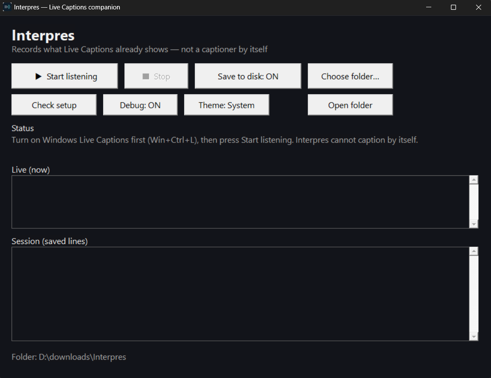

# Interpres

<p align="center">
  
</p>

**Save what Live Captions already shows — so you can read it again later.**

Interpres is a free, open-source helper for **Deaf and hard of hearing** people on **Windows** and **Mac**.  
It does **not** replace Live Captions. It does **not** listen to your microphone by itself.  
It works **with** the Live Captions your computer already has, and can **save** those words into a simple text file on your PC or Mac.

No subscription. No cloud account. No paid product. Everything stays **on your computer** unless **you** copy the files somewhere else.

<p align="center">
  
</p>

<p align="center"><em>Windows version (native Win32 window). Mac uses its own native AppKit window. Same idea on both: companion to OS Live Captions, not a stand-alone captioner.</em></p>

---

## Please read this first (important)

| Interpres **is** | Interpres **is not** |
|------------------|----------------------|
| A **local recording companion** for OS Live Captions | A speech-to-text engine on its own |
| Able to **save** what captions show when they work | A guarantee of **100% accurate** words |
| Meant to work **with** Windows or Mac Live Captions | A replacement for Live Captions |
| Best-effort (captions can revise, lag, or miss words) | Perfect legal or medical transcripts |

**Plain language:**

- Interpres only captures **what Live Captions is already showing** on screen.  
- If Live Captions is wrong, late, or empty, Interpres can only save **that** — it cannot “hear better” than the OS.  
- Live Captions often **rewrites** a line as it improves the guess. Interpres tries to follow those updates, but **cannot promise perfection**.  
- You turn on **system Live Captions first**. Interpres **cannot work alone**.

This tool is for **keeping a personal record** of what your captions showed (notes, “what did they say?”, follow-up) — not for promising every word of a meeting forever.

---

## Easy start (no programming)

### 1. Download a ready build

**https://github.com/IronAdamant/Interpres/releases**

Pick the pack for your computer:

| Computer | What to download | What to open |
|----------|------------------|--------------|
| **Mac** | Portable Mac pack (zip) | Double-click **Interpres.app** |
| **Windows** | Portable Windows pack (zip) | Open the folder → double-click **interpres.exe** or **Open Interpres.bat** |
| **Linux** | *Not supported* (no official build) | See [Linux](#linux-not-supported-officially) below |

You do **not** need to install from the App Store or use the terminal for normal use.

### 2. Turn on Live Captions (required)

| Mac | Windows |
|-----|---------|
| **System Settings → Accessibility → Live Captions → On** | **Win + Ctrl + L** (or Settings → Accessibility → Captions → Live captions) |

Play audio (video, call, meeting) so captions appear.

### 3. Use Interpres

1. Open Interpres (app or `.exe` as above).  
2. Press **Start listening**.  
3. Optional: **Save to disk: ON** and **Choose folder…** (default is often Documents → Interpres Transcripts).  
4. Optional: **Theme: System / Light / Dark** — appearance only (follows your OS by default; does not change caption capture).  
5. When you finish, press **Stop**.

**Mac only:** if no text appears, System Settings → Privacy & Security → **Accessibility** → allow **Interpres** (or Terminal if you use the command line). Quit and reopen Interpres after changing that.

**Windows only:** keep the included `Get-LiveCaptionsText.ps1` **in the same folder** as `interpres.exe` (the release pack already does this).

### 4. Find your files

When saving is **ON**, each session creates a new text file with the **date and time** in the name, for example:

`2026-08-06_14-22-01.txt`

---

## Privacy

- Captions and transcripts stay **local** unless **you** move them.  
- Saving to disk defaults to **off** until you turn it on.  
- Interpres is **not** a cloud speech service.

---

## Common questions

**Why is a word wrong in the file?**  
Live Captions guessed wrong or rewrote the line. Interpres saved what captions showed. It cannot fix OS speech recognition.

**Why is the live box empty?**  
Live Captions may be off, paused, or not trusted (Mac Accessibility). Use **Check setup** on Mac, or turn Live Captions on with **Win+Ctrl+L** on Windows, then **Start listening**.

**Can I use this without Live Captions?**  
Only **demo** mode (sample file). Real capture always needs OS Live Captions.

**Does this work on Linux?**  
**Not as an official product.** See [Linux](#linux-not-supported-officially) below.

---

## Linux (not supported officially)

**Interpres is maintained for Windows and Mac only.**

Most Linux desktops do **not** ship a built-in Live Captions feature the way Windows and macOS do. Captioning on Linux is usually a **separate app** you install (or browser Live Caption), and every distro / DE / language setup differs.

**If you want Interpres-style behaviour on Linux:**

1. **Fork this repository** under your own account.  
2. Wire capture to **whatever caption program you use** on your distro (system accessibility text, a third-party live-captions app, browser captions, etc.).  
3. Own the work for **your** desktop environment, packaging, and especially **your language** — speech models and UI text surfaces are not the same as English OS Live Captions.  
4. Publish your fork under the same **MIT OR Apache-2.0** terms if you wish; that is the point of open source.

The shared Rust **core** (session files, buffer, config) may be useful as a starting point. There is **no** commitment to implement, test, or support a Linux capture path, native UI, or multi-language caption backends here. Time and funding for that work are not available for this project.

Please do **not** open issues asking for “Linux support” or “add language X” as project deliverables. PRs that keep the Mac/Windows product intact and document a fork-friendly hook are welcome to discuss; full platform ownership stays with the fork maintainer.

---

## For developers (advanced)

Strict **zero crates.io** dependencies. Native UI: **AppKit** on Mac, **Win32** on Windows. Same core engine.

Default capture poll is **150ms** (`poll_ms` in settings) so short Live Captions lines are less likely to vanish between samples. Lower = snappier / more CPU. Debug mode logs top AX/speech candidates vs the merged surface pick.

```text
cargo test
cargo build --release
```

| Platform | Package a portable folder |
|----------|---------------------------|
| Mac | `./packaging/make-double-click.sh` |
| Windows | `powershell -NoProfile -ExecutionPolicy Bypass -File packaging\make-windows-release.ps1` |
| Linux | No packaging script — [fork if you need it](#linux-not-supported-officially) |

CLI (optional): `interpres run`, `probe`, `diagnose`, `remember on|off`, `set-folder`, `demo`, `help`.

More detail: [docs/KNOWN-ISSUES.md](docs/KNOWN-ISSUES.md), [docs/SIGNALS.md](docs/SIGNALS.md), [docs/VERIFY.md](docs/VERIFY.md), [MD/LIVE-CAPTIONS-REBUILD-PLAN.md](MD/LIVE-CAPTIONS-REBUILD-PLAN.md).

License: **MIT OR Apache-2.0**.

---

## Status

**v0.2** — **Windows and Mac** Live Captions companion: native window, opt-in dated session files, sticky folder, local only. Best-effort capture of the OS caption surface; not a standalone captioner. **Linux is not an official target** — fork if you need another OS or language stack.
