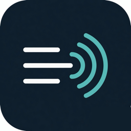

# Interpres

<p align="center">
  
</p>

**Save what Live Captions say — so you can read it again later.**

Interpres is a free, open-source helper for **Deaf and hard of hearing** people on **Windows** and **Mac**. It does not replace your captions. It works **with** the Live Captions your computer already has.

This project was **rebuilt from the ground up**. After real meetings, interviews, and everyday conversations, it became clear that **Windows Live Captions** and **macOS Live Captions** already work well for *reading* speech live. What was missing was a simple, local way to **keep a transcript** — one file per session, with the date and time — so you can remember what was said.

No subscription. No cloud account. No paid product. Public open source for anyone to use or fork.

---

## What it does

| You already have | Interpres adds |
|------------------|----------------|
| Live Captions on screen | Optional **saved transcript** |
| Great for the moment | Great for **later** (notes, follow-up, “what did they say?”) |

- Works with **Windows 11 Live Captions** and **Mac Live Captions**
- **You choose the folder** for transcripts (it remembers that folder)
- **One new file per session**, named with **date and time** (for example `2026-08-05_14-22-01.txt`)
- Saving is **off until you turn it on** (your privacy, your choice)
- Everything stays **on your computer**

---

## Easy start (non-technical) — real Mac window, not a webpage

You do **not** need the command line for day-to-day use.  
On a Mac, Interpres opens a **custom native window** (AppKit). Rust keeps working in the background. **No browser UI. No crates.io GUI frameworks.**

### Download a ready build (Mac)

**https://github.com/IronAdamant/Interpres/releases**

Unzip the portable pack → double-click **Interpres.app**.

Builds are **not obfuscated** — see [docs/VERIFY.md](docs/VERIFY.md).

### Build the clickable app yourself (Mac with Rust)

```text
./packaging/make-double-click.sh
open dist/Interpres
```

Then double-click **Interpres.app**.

### What you do in the window

1. Turn on **Live Captions** (System Settings → Accessibility → Live Captions)  
2. Press **Check setup** if you want a permission check  
3. Press **Start listening**  
4. Optional: **Save to disk: ON** and **Choose folder…**

If captions never appear: System Settings → Privacy & Security → **Accessibility** → enable **Interpres**.

### Advanced (terminal)

```text
cargo run --release          # opens the native window on Mac
cargo run --release -- run   # CLI only
cargo test
```

Zero **crates.io** dependencies. Mac UI is system **AppKit** compiled with `clang` (`native/macos/`, `build.rs`).
---

## Common commands

| Command | Meaning |
|---------|---------|
| `interpres run` | Capture while Live Captions is on (default) |
| `interpres probe` | Self-check (is Live Captions running? any permission issue?) |
| `interpres set-folder PATH` | Sticky transcript folder |
| `interpres remember on` / `off` | Save to disk or not |
| `interpres show-config` | Show current settings |
| `interpres demo` | Create a sample transcript **without** Live Captions |
| `interpres watch` | Print when Live Captions starts or stops |
| `interpres help` | Short help |

---

## Privacy

- Captions and transcripts stay **local** unless **you** copy files somewhere else  
- Disk saving defaults to **off**  
- Interpres is **not** a speech service in the cloud  

Windows and Mac do not officially “export” Live Captions. Interpres reads the caption UI the accessibility way so *you* can keep a personal record.

---

## For developers

- **Strict zero third-party Rust crates** in the core (`Cargo.toml` has an empty `[dependencies]`)  
- Platform access: process checks + hand-written OS APIs / small helpers under `helpers/`  
- Plan of record: [`MD/LIVE-CAPTIONS-REBUILD-PLAN.md`](MD/LIVE-CAPTIONS-REBUILD-PLAN.md)  
- Known issues / fix plan: [`docs/KNOWN-ISSUES.md`](docs/KNOWN-ISSUES.md), [`MD/FIX-KNOWN-ISSUES-PLAN.md`](MD/FIX-KNOWN-ISSUES-PLAN.md)  
- Protocol / signal notes: [`docs/PROTOCOL.md`](docs/PROTOCOL.md), [`docs/SIGNALS.md`](docs/SIGNALS.md)  
- License: **MIT OR Apache-2.0** — fork freely  

```text
cargo test
cargo run -- probe
cargo run -- demo
```

---

## Accessibility keywords (plain language)

If you are searching for tools around **live captions**, **real-time captions**, **offline transcripts**, **Deaf accessibility**, **hard of hearing**, **Windows 11 Live Captions**, **Mac Live Captions**, or **meeting caption history**, Interpres is a small local companion: it does not try to be another AI meeting bot — it helps you **keep the words** your system already shows.

---

## Status

Ground-up rebuild (v0.2): Live Captions companion, dated session files, sticky folder, probe, strict zero-dependency core. Optional polish (installers, tray watcher packaging) can grow on top without changing that core idea.

### Known issues (Mac)

Confirmed from real Live Captions + YouTube sessions (and short AgentVideoParse frame packs):

- macOS **chrome junk** sometimes scraped (e.g. “Correct Spelling Automatically”)  
- **Save / folder labels** can disagree with real save state  
- Live text can **lag** when the Accessibility surface sticks  
- Occasional **near-duplicate** lines when captions rewrite a sentence  

Details and status: **[docs/KNOWN-ISSUES.md](docs/KNOWN-ISSUES.md)**  
Fix order: **[MD/FIX-KNOWN-ISSUES-PLAN.md](MD/FIX-KNOWN-ISSUES-PLAN.md)**
