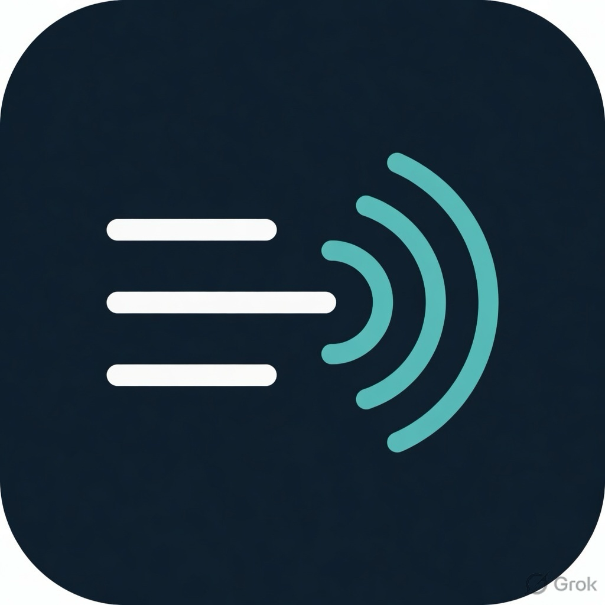
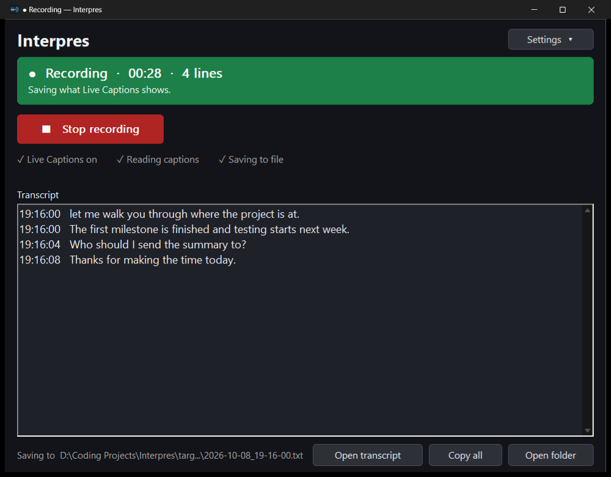
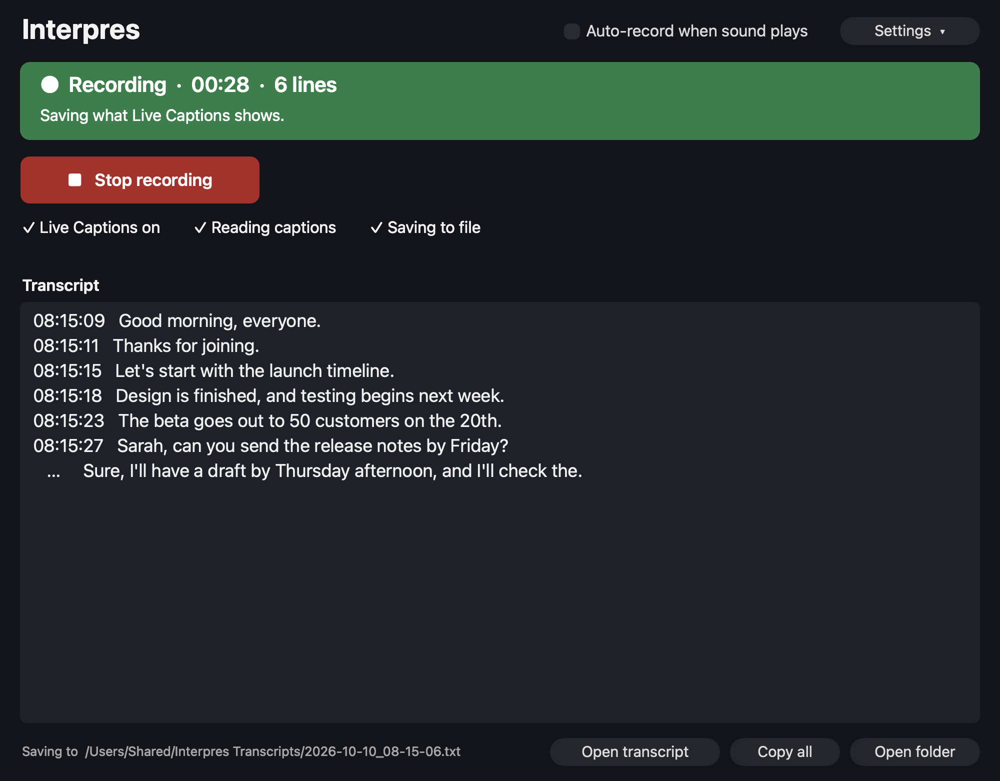

# Interpres

<p align="center">
  
</p>

**Save what Live Captions shows, so you have the words after the meeting.**

Live Captions is built into **Windows 11** and **macOS**. It shows what people are saying as text on your screen, but the words disappear once they scroll away. Interpres keeps them: it saves the captions to a plain text file you can read, search and copy later.

It's useful if you're Deaf or hard of hearing, find speech hard to follow, or are working in a second language. It's also handy for anyone who wants notes from a call or video.

- **Free** and open source
- **No account, no cloud.** Everything stays on your computer.
- **Doesn't listen to anything itself.** It only saves what Live Captions already shows.

<p align="center">
  
  
  <br />
  <em>Windows (left) and Mac (right)</em>
</p>

---

## Get started on Windows 11

1. **Download** the Windows zip from **[Releases](https://github.com/IronAdamant/Interpres/releases)**. Right-click it and choose **Extract All**.
2. **Open** `interpres.exe` from the extracted folder. There's nothing to install.
   If Windows says *“Windows protected your PC”*, click **More info**, then **Run anyway**. (Interpres isn't signed with a paid certificate.)
3. **Turn on Live Captions.** If Interpres says *Live Captions is off*, press **Turn on Live Captions** (or press **Win + Ctrl + L**).
4. Press **Start recording** before your meeting.
5. Press **Stop recording** when you're done.

That's it. Use **Open transcript** or **Copy all** to put the text in your notes.

---

## Get started on Mac

For Macs with Apple Silicon (M1 or newer), on macOS 13 or later.

1. **Download** the Mac zip from **[Releases](https://github.com/IronAdamant/Interpres/releases)** and double-click it to unzip. Move **Interpres.app** to your Applications folder.
2. **Open** Interpres.app. The first time, your Mac says it can't check who made it. Go to **System Settings → Privacy & Security**, scroll down and click **Open Anyway**. (Interpres isn't signed with a paid Apple account.)
3. **Let Interpres read the captions.** Your Mac asks for **Accessibility** permission. Turn on Interpres in the list that opens.
   *After you update Interpres, switch it off and on again in that list.*
4. **Turn on Live Captions** in **System Settings → Accessibility → Live Captions**. The **Turn on Live Captions** button in Interpres opens that page for you.
5. Press **Start recording** before your meeting, and **Stop recording** when you're done.

Use **Open transcript** or **Copy all** to put the text in your notes.

---

## Everyday use

### The coloured banner

The banner at the top tells you whether your words are being saved.

| Banner | What it means | What to do |
|--------|---------------|------------|
| 🟩 **Recording · 12:40 · 48 lines** | Captions are being saved | Nothing |
| 🟦 **Ready — waiting for speech** | Live Captions is on, but nobody is talking yet | Nothing |
| 🟥 **Live Captions is off** | Nothing can be saved | Press **Turn on Live Captions** |
| 🟥 **Not capturing — can't read Live Captions** | Captions are being missed | Press **Restart Live Captions**. On Mac, see [the Mac tip below](#common-questions) |
| 🟧 **No new captions for 3 min — are you done?** | It has gone quiet | Press **Stop & save** or **Keep recording** |

When the banner turns red, Interpres also gets your attention: the taskbar button flashes on Windows, the Dock icon bounces on Mac, and a sound plays.

Interpres never stops recording on its own (unless you turn on auto-record, below). When things go quiet, it asks you instead.

If Live Captions closes or restarts during a meeting, Interpres keeps going in the same file.

### Auto-record: never forget to press Start

Tick **Auto-record when sound plays** at the top of the window, and leave Interpres open.

- When a meeting or video starts playing, Interpres **starts recording by itself**. On Windows it also turns Live Captions on if needed.
- When everything has been quiet for **5 minutes**, it **stops and saves**.
- The next time something plays, a new recording starts.

Want it ready every day? In **Settings**, turn on **Start Interpres when Windows starts** (on Mac: **Open Interpres at login**). Interpres then opens in the background when you sign in.

Interpres never records sound. On Windows it only checks how loud the speakers are. On Mac it checks that something is playing *and* that Live Captions is showing new words, so keep Live Captions on.

### Your transcripts

Each recording is saved as its own text file in **Documents → Interpres Transcripts**, named with the date and time, like `2026-10-08_17-59-54.txt`. Open it with Notepad, TextEdit or any text editor:

```text
# Interpres session started 2026-10-08 17-59-54
# Source: Windows Live Captions

[18:04:07] If I unmute myself.
[18:04:10] How are you?
[18:09:24] So that's the premise.

# Session ended (user)
```

Each line shows the time it was said. Every line is saved the moment it appears, so closing Interpres by accident doesn't lose anything.

### Settings

Click **Settings** (top right) for these options:

| Option | What it does |
|--------|--------------|
| Save transcripts to disk | Turn saving on or off. When off, captions only show in the window |
| Change transcripts folder / Open transcripts folder | Choose or open where your files go |
| Start Interpres when Windows starts (Mac: Open Interpres at login) | Opens Interpres in the background when you sign in |
| Check Live Captions setup | Tests whether Interpres can read Live Captions right now |
| Restart Live Captions | Fixes Live Captions when it gets stuck |
| Open Live Captions settings *(Mac)* | Opens the page where you turn Live Captions on |
| Accessibility permission… *(Mac)* | Opens the list where you allow Interpres to read captions |
| Theme | Match your computer, light, or dark |
| Write debug log | Saves a troubleshooting file next to your transcripts. Only needed if something goes wrong |

The other options in the menu (caption source, settings file) are for [advanced use](#advanced).

---

## Privacy

- Your captions and transcripts **stay on your computer**. Interpres never connects to the internet.
- If you only want captions on screen, turn off **Settings → Save transcripts to disk**, and nothing is kept.

### Saving what other people say

A transcript holds other people's words, not just yours. Before you save a meeting, class or call:

- **Check the rules where you are.** Your workplace, school or the meeting host may have a policy on recording or transcribing. In some places, keeping a record of a conversation needs everyone's consent.
- **Tell people when it matters.** "I use captions and keep a transcript to follow along" is usually enough, and most people are happy to hear it.
- **Treat the files like meeting notes.** Keep them private, don't share them without permission, and delete the ones you no longer need.

---

## Common questions

**Does it work with Zoom, Teams, Google Meet, YouTube…?**
Yes. Anything Live Captions can caption, Interpres can save: calls, videos, podcasts, and anything else that plays sound on your computer.

**Which languages does it support?**
The same ones as Live Captions on your computer. Interpres saves whatever text Live Captions shows.

**Where are my transcripts?**
In **Documents → Interpres Transcripts**, or click **Open folder** in Interpres.

**Is it really free?**
Yes. No ads, no subscription, no account. The code is open source.

**A word in the file is wrong.**
Live Captions misheard it. Interpres saves exactly what Live Captions showed.

**The banner says “can't read Live Captions”.**
Press **Restart Live Captions**; recording carries on in the same file.
**On Mac**, this usually means Interpres lost its Accessibility permission (macOS forgets it after an update). Click **Settings → Accessibility permission…**, switch Interpres off and on again, then reopen Interpres.
If it keeps happening, turn on **Write debug log** in Settings and keep the `.debug.log` file that appears next to the transcript.

**Does it work on Intel Macs?**
Not for now. The code is open source, so you can build it yourself.

**Does it work on Linux?**
No.

---

## Known issues

- Live Captions sometimes changes earlier words after the fact. Interpres keeps the most polished version it sees, but now and then a line is saved twice with small differences, or slightly out of order.
- Interpres can only save what Live Captions shows. If Live Captions isn't showing anything, the banner says **Ready — waiting for speech** and nothing is being saved.

---

## Advanced

Everything below is optional. You don't need any of it to use Interpres.

### Use your own speech engine

Live Captions is the easy option and needs no setup. If you run your own speech-to-text model (for example **Phonon-2**, **Parakeet** or **Whisper**), Interpres can save its output instead, with the same banner, prompts and files. This works on Windows and Mac.

Interpres doesn't bundle or download any model. You point it at your engine program in the settings file, and the engine prints caption lines that Interpres saves. Interpres itself stays zero-dependency; your engine brings its own.

```ini
source=engine
helper_path=C:\Users\you\AppData\Local\Programs\Python\Python313\python.exe
helper_args=-u "C:\engines\my_engine.py"
```

See **[docs/ENGINES.md](docs/ENGINES.md)** for the line format and a standard-library Python example engine ([`examples/engines/example_engine.py`](examples/engines/example_engine.py)). Switch between Live Captions and your engine under **Settings → Captions from**.

### Settings file

**Settings → Edit settings file…** opens it (Notepad on Windows, TextEdit on Mac). It lives at `%APPDATA%\Interpres\settings.conf` on Windows and `~/.config/interpres/settings.conf` on Mac, as `key=value` lines:

| Key | Default | Meaning |
|-----|---------|---------|
| `remember` | `true` | Save transcripts to disk |
| `transcript_folder` | Documents\Interpres Transcripts | Where files go |
| `idle_prompt_minutes` | `3` | Ask “are you done?” after this many quiet minutes (`0` = never) |
| `auto_record` | `false` | Start recording when sound plays; same as the **Auto-record** checkbox |
| `auto_stop_quiet_minutes` | `5` | With auto-record on: stop and save after this many quiet minutes (`0` = never) |
| `debug` | `false` | Write `interpres-debug.log` and a `.debug.log` per recording |
| `theme` | `system` | `system`, `light`, or `dark` |
| `write_jsonl` | `false` | Also write a machine-readable `.jsonl` next to each transcript |
| `source` | `os` | `os` = Live Captions, `engine` = your own engine ([docs/ENGINES.md](docs/ENGINES.md)) |
| `helper_path` | (empty) | Engine program, as a full path |
| `helper_args` | (empty) | Engine arguments; double quotes group paths with spaces |

Changes apply the next time you press **Start recording**.

### Command line

`interpres run`, `probe`, `diagnose`, `remember on|off`, `set-folder`, `demo`, `help`. `interpres diagnose` prints what Interpres can read from Live Captions right now.

### For developers

Rust, zero crates.io dependencies. Native UI on both systems: Win32 on Windows, AppKit on Mac (compiled by `build.rs` with the system clang). On Windows, captions are read in-process through UI Automation COM (`src/platform/windows_uia.rs`) with 1.5 s connect and 2.5 s per-call timeouts and a watchdog. On Mac, they are read through the Accessibility API (`src/platform/macos.rs`) with a 2.5 s call timeout.

```text
cargo test
cargo build --release
powershell -NoProfile -ExecutionPolicy Bypass -File packaging\make-windows-release.ps1   # Windows zip
bash packaging/make-double-click.sh                                                       # Mac: dist/Interpres/Interpres.app + zip
```

The `x86_64-pc-windows-gnu` toolchain needs a MinGW with `libgcc` (for example WinLibs) first on `PATH` to link tests. llvm-mingw alone fails with `unable to find library -lgcc_eh`.

| File | Purpose |
|------|---------|
| `src/app_view.rs` | What the window shows (banner, checklist, transcript rows, auto-record), shared by both UIs |
| `src/gui_win.rs` | Windows UI |
| `src/gui.rs`, `native/macos/` | Mac UI (AppKit) |
| `src/platform/windows_uia.rs` | Hand-written UI Automation COM bindings |
| `src/platform/windows.rs` | Reader thread, watchdog, turn on / restart Live Captions |
| `src/platform/macos.rs` | Reads Mac Live Captions through Accessibility; in-process process lookup |
| `src/platform/macos_audio.rs` | Mac auto-record signal: an app is playing and Live Captions is captioning |
| `src/health.rs` | Banner states and the “are you done?” prompt |
| `src/engine.rs` | Capture loop, external-engine loop, session files, end-of-recording drain |
| `src/plugin_host.rs` | Runs an external engine and reads its protocol lines |
| `src/buffer.rs` | Turns the rolling caption text into finished lines |
| `src/history_ui.rs` | Decides how each caption changes the saved lines (polishes, repeats, split sentences) |

Debugging:
- With Live Captions open, `cargo test --lib dump_live_surface -- --ignored --nocapture` (Windows) or `cargo test --lib dump_ax_tree -- --ignored --nocapture` (Mac) dumps what Live Captions exposes.
- `INTERPRES_REPLAY=/path/to/x.debug.log cargo test --lib replay_debug_log -- --ignored --nocapture` replays a recording's caption events through the transcript writer and prints line and repeat counts.
- `INTERPRES_SNAPSHOT=shot.png` (Mac) saves a picture of the window; `INTERPRES_SNAPSHOT_AFTER=30` delays it by 30 seconds.

License: **MIT OR Apache-2.0**.
